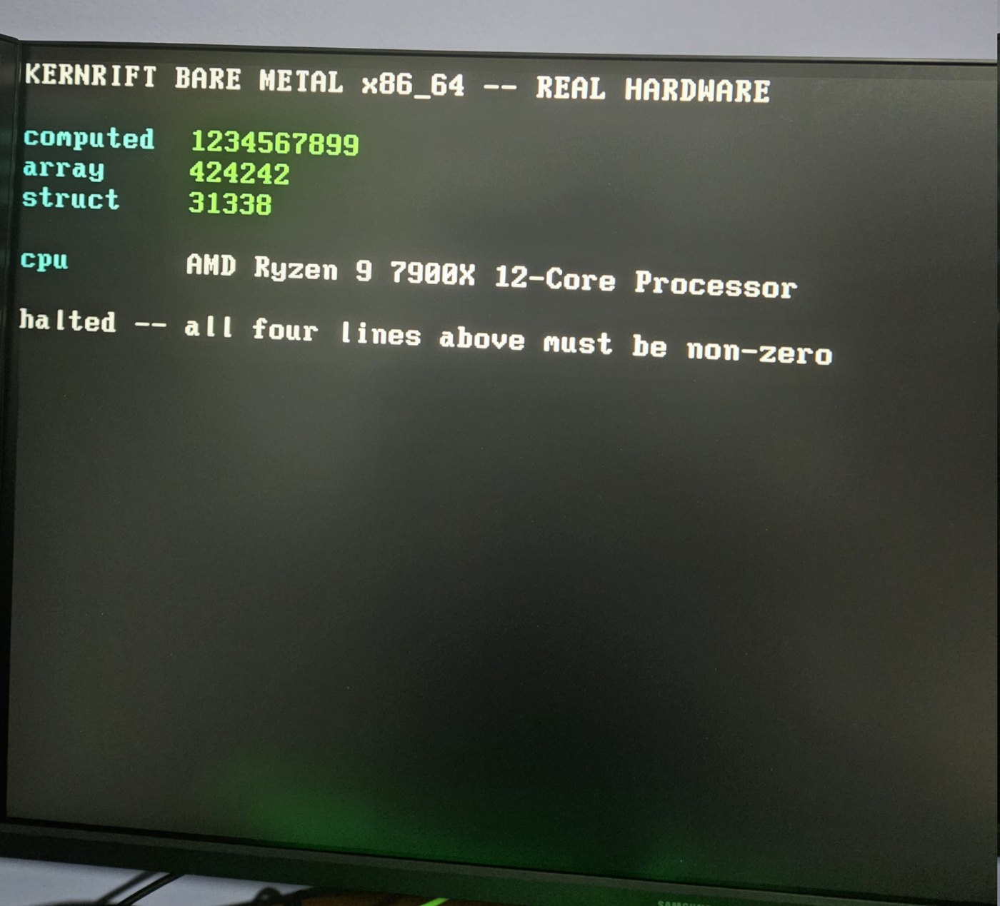

# KernRift

**KernRift is a bare-metal systems programming language and compiler created by Pantelis Christou.**

A self-hosted systems language compiler for kernel-first development. KernRift compiles itself — no Rust, no C, no LLVM, no external toolchain. It produces native executables for x86_64 and AArch64 on Linux, Windows, macOS, and Android, with BCJ+LZ-Rift-compressed fat binaries as the default output (8 platform slices per `.krbo`). The `kr` runner executes `.krbo` fat binaries on any supported platform. The compiler self-hosts on all 8 targets, with the per-target caveats in [What is actually proven](#what-is-actually-proven) — read that before relying on any of them. The compiler ships with an **optimising IR backend** — not SSA; linear three-address code over unbounded vregs, with named variables reusing one vreg across assignments — with liveness analysis, graph-coloring register allocation, an AST-level function inliner, Briggs/George copy coalescing, LICM, constant folding, DCE, and CSE — producing native machine code for all targets directly from the IR, no assembler in the loop.

Beyond the eight hosted platform targets, the same IR feeds three **embedded
backends** — 32-bit RISC-V (`--arch=riscv32`), Xtensa LX6 (`--arch=xtensa`),
and the **ESP32** machine target (`--target=esp32`), which emits a direct-boot
image the mask ROM loads straight from flash. These backends are a deliberate
subset of the language, not a second full implementation: see
[Embedded targets](#embedded-targets-riscv32--xtensa--esp32) for exactly what
is and is not supported.

## What is actually proven



*2026-08-13. A KernRift program, compiled by KernRift, booted from a USB stick
on a physical AMD Ryzen 9 7900X with no operating system underneath it. The
values are computed at runtime, not printed literals. The `cpu` line is read
out of `CPUID` leaves `0x80000002`–`0x80000004` by the program itself — under
emulation that line reads `QEMU Virtual CPU version 2.5+`, so the photograph
authenticates itself. Source:
[`tests/target_none/boot/hw_sentinel_x86.kr`](tests/target_none/boot/hw_sentinel_x86.kr).*

Read this table before anything else in this README. It is the honest version
of every capability claim below it, and where the two disagree, this table
wins.

| Status | Meaning |
|---|---|
| 🟢 **Real hardware** | Ran on physical silicon, with evidence that could not have been produced under emulation. |
| 🔵 **CI-verified** | Runs on every push, on a real runner of that OS/arch. |
| 🟡 **Emulated, translated, or partial** | Nothing outside an emulator has run it, or it runs natively but is only partly exercised. The row says which. |
| 🟠 **Experimental** | Usable, but a deliberate subset with limits that will stop you quickly. |
| 🔴 **Not implemented** | Refused at compile time. |
| ⚪ **Out of scope** | A deliberate boundary or an inherent property of the output — not a TODO, and not something to be fixed by trying again. |

### Hosted targets — this is where the real coverage is

| Target | Status | What was actually run |
|---|---|---|
| Linux x86_64 | 🔵 CI-verified | Self-compiles to a bootstrap fixed point; the full **1404-test** suite passes. This is the primary development target. |
| Linux ARM64 | 🔵 CI-verified | Self-compiles to a fixed point; suite runs on a native ARM64 runner. |
| Windows x86_64 | 🔵 CI-verified + hardware | Self-compile chain on a `windows-latest` runner every push. Also verified 2026-08-14 on a physical **Intel Core Ultra 9 275HX / Windows 11 Pro** laptop: the compiler rebuilt its own source twice on the machine and stages 1-3 are byte-identical (`sha256 5b21ae16…`), with the laptop-built compiler then compiling and running a program correctly. |
| Windows ARM64 | 🔵 CI-verified | Self-compile chain through a fixed point on a `windows-11-arm` runner. |
| macOS x86_64 | 🟡 Translated | GitHub has no x86_64 macOS runner here: the `macos-14` runner is ARM64, and the x86_64 slice is executed through `arch -x86_64`, i.e. **Rosetta translation**. It runs and it self-compiles, but not on an x86_64 Mac. |
| macOS ARM64 | 🟡 Partly verified | CI runs cross-compiled test binaries on `macos-14`, but there is **no self-compile step for macOS ARM64 in CI**. Treat "self-hosts on ARM Macs" as untested by CI. |
| Android ARM64 | 🟢 Real hardware | **Self-compiles to a bootstrap fixed point on a physical phone.** Verified 2026-08-14 on a Redmi Note 8 Pro (Android 11, arm64-v8a): the compiler was pushed over `adb`, rebuilt its own 3.1 MB source on the device in 4.9 s, and the stage-2 and stage-3 binaries are **byte-identical** (`sha256 8a39f8f6…`) to each other and to the cross-compiled one. The phone-built compiler then compiled and ran a program correctly. This runs under **bionic** — `/system/bin/linker64` is the Android runtime linker and the device has no glibc loader at all. CI cannot reproduce this: its Android jobs run PIE ELFs under the *glibc* loader on Linux. |
| Android x86_64 | 🟡 Emulated in CI | The Android artifact is executed by invoking `/lib64/ld-linux-x86-64.so.2` directly on the x86_64 Linux CI box. **No bionic, no device.** |

### Bare metal

| Capability | Status | What was actually run |
|---|---|---|
| **x86_64, GRUB multiboot** | 🟢 **Real hardware (2026-08-13)** | Booted from USB on an **AMD Ryzen 9 7900X** desktop and printed to VGA text memory. The artifact prints the CPU's own brand string from `CPUID` leaves `0x80000002–4`, so the screen is self-authenticating: under emulation that line reads `QEMU Virtual CPU version 2.5+`, and on the desktop it read the AMD part. Source: [`tests/target_none/boot/hw_sentinel_x86.kr`](tests/target_none/boot/hw_sentinel_x86.kr). This is the project's strongest single claim. |
| arm64 bare metal (`--emit=image`) | 🟢 Real hardware | The boot gate's sentinel runs under `qemu-system-aarch64`, but the interesting result is downstream: a **KernRift Phone OS** boots on a Redmi Note 8 Pro (MediaTek MT6785) and drives real peripherals — MMU on with caches, the full 1080×2340 framebuffer, MT6360 PMIC over I2C5, MTK SPI5, and a Novatek NT36672A touchscreen whose ~110 KB firmware the KernRift code downloads into the chip's SRAM each boot. A zero-Rust variant emits the boot image from `krc --emit=image --image-header --stack-top --load-addr` alone — no rustc, no linker script — with the required gzip done by `std/gzip.kr`. That artifact carries a valid arm64 `Image` header (`ARMd` magic, `image_size 0x5780`, flags `0xa`), byte-shaped exactly as `krc` emits today. I have booted this on my own handset; it is not reproducible from this repo alone. |
| UEFI (`--emit=uefi`) | 🟡 QEMU only | Loads and prints under OVMF (x86_64) and AAVMF (arm64) — emulated firmware, not a vendor's. |
| UEFI + Secure Boot | ⚪ Incompatible (measured) | An MS-key OVMF **refuses** the identical artifact that runs with Secure Boot off. The images are unsigned, so a firmware that checks signatures rejects them — that is the system working, not a compile-time refusal or a defect. Signing would need a key, an `sbsign` equivalent, and a `.reloc`-free image the signer accepts; none of that exists here and none is planned. |
| `--reset-vector` | 🟡 QEMU only, by design | A 64 KiB image boots from the CPU reset vector under `qemu -bios`, reaching real → protected → long mode. It *replaces* firmware, so running it on a real board means flashing a BIOS; that is deliberately out of scope. |
| Linux kernel modules (`--emit=lkm`) | 🟢 Real hardware | `examples/hello_lkm.kr` **loads into a running Linux kernel** and executes in kernel space. Verified 2026-08-14 on 7.0.0-28-generic: `insmod` succeeds, `lsmod` shows `hello_kr` resident, `modinfo` reads the license/author/name, and the kernel log carries both the init and exit prints — `Hello from KernRift` at load, `Bye from KernRift` at `rmmod`, which then unloads cleanly. Requires Secure Boot off, since the module is unsigned (it taints `OE`). The `.ko` build is in CI; the load/unload cycle is not, so that part is manual. |

The bare-metal boot gate has **59 legs, all passing**, and runs on every push
— but with the single exception of the multiboot row above, every leg of it is
QEMU.

### Embedded targets — Xtensa/ESP32 is the real one

| Target | Status | Detail |
|---|---|---|
| ESP32 (`--target=esp32`) | 🟢 Real hardware | `examples/esp32/hello.kr` boots from flash on an ESP32-D0WD-V3 and prints over UART0. |
| Xtensa LX6 | 🟢 Real hardware | The backend behind the ESP32 row. Freestanding blobs flashed to real boards have carried downstream projects — including **CarRift**, an ESP32 CAN interface whose KernRift firmware drives a real TI VP230 transceiver, putting actual CANH/CANL on the wire at 500 kbit/s and round-tripping frames, verified 9 resets out of 9 on an ESP32-D0WD-V3. (Bench-validated at the target vehicle's bit rate; it has not yet been attached to a live vehicle bus.) Hosted ELF emission and `-c` relocatables are refused (`not yet implemented`), and neither is on the path to an MCU: you flash a blob, you do not link objects against an OS that isn't there. |
| riscv32 (RV32IMC) | 🟠 **Unfinished — scaffolding** | Built as a stepping stone to the Xtensa backend, not as a target in its own right: a simpler 32-bit ISA to get the shared 32-bit code paths right before tackling Xtensa and the ESP32. It works as far as it goes — hosted ELF32 and `--freestanding` blobs build, `.o` emission works, verified under `qemu-riscv32-static` — but it is **not finished and nobody should build on it**. Its job was to make the target below possible. |
| **The standard library on riscv32 / xtensa** | ⚪ **Out of scope by design** | `std/` targets 64-bit hosts: it is written in `u64` throughout, and on a 4-byte-word target the compiler refuses that outright — `error: 64-bit integers not supported on riscv32; use uint32`. So none of the 35 modules import on these targets, and that is the type system doing its job rather than a missing port. Embedded programs are written against the builtins and fixed-size types, which is what the ESP32 example does. |

So the general-purpose, library-backed coverage of this compiler is **x86_64 and
ARM64**. The 32-bit backends exist for one reason: to put KernRift on an ESP32.
riscv32 was the stepping stone — a simpler ISA to get the shared 32-bit paths
right — and **Xtensa/ESP32 was the goal and is the part that works**, with real
firmware flashed to real boards. Their lack of `std/` is by design; riscv32's
own incompleteness is not, and does not hold Xtensa back.

**v2.10.0 highlights** (full details in [CHANGELOG.md](CHANGELOG.md)):

**The release where bare metal stopped meaning QEMU.** A KernRift program, compiled by KernRift, boots from a USB stick on a physical AMD Ryzen 9 7900X with no operating system underneath it — and prints the CPU's own brand string out of `CPUID`, so the photograph above cannot have been produced under emulation. Three more results moved onto real devices in this release: the compiler self-compiles to a bootstrap fixed point on a physical Android handset under bionic and on a physical Windows laptop, and a KernRift-emitted kernel module loads into a running Linux kernel. Everything else bare-metal — arm64 images, UEFI under OVMF, the reset-vector path — is still QEMU, and [What is actually proven](#what-is-actually-proven) says so per row. Secure Boot is **incompatible** by construction: the images are unsigned. The boot gate has 59 legs and runs in CI on every push, including on a native ARM64 runner.

This release also fixes a long list of silent miscompiles, the worst of which made `bool b = true; b * 2` evaluate to **0** on the default backend. See the changelog.

- **`--target=none`** — freestanding, no libc, no host OS. Refuses every OS-bound construct and routes `print`/`println`/f-strings/`alloc` through pluggable write/alloc providers instead.
- **`--emit=image`** — raw flat binary, no container, plus a QEMU boot gate in the test suite that requires a computed sentinel value on the wire, not just "QEMU didn't crash".
- **Compiler-emitted entry stubs** (`--stack-top`) — a `--target=none` binary no longer needs a hand-written loader to set up a stack before jumping into `main`; images are self-sufficient on both arches.
- **`--image-header`** — prefixes the arm64 Linux `Image` header (64 bytes, magic `0x644d5241`) so an arm64 build can be handed directly to a Linux boot loader.
- **`--emit=uefi`** — PE32+ EFI applications that load and print under QEMU's OVMF (x86_64) and AAVMF (arm64). Booting verified under emulated firmware only; unsigned, so Secure Boot refuses it.
- **`--reset-vector`** — a 64 KiB x86_64 image that boots straight from the CPU reset vector under `qemu -bios`, reaching 16-bit real → 32-bit protected → long mode and running its payload, with no GNU `as`, `ld`, `objcopy`, or `--defsym` anywhere in the build.
- **Defect fixes that change behaviour.** `call_ptr` silently dropped arguments 7+ *and their side effects*; now refused on both x86 backends. An unresolved `extern fn` produced a running binary with a wrong answer, differently per backend; now a hard error in executable emit modes. `--image-header=`, `--reset-vector=`, `-c=`, `-h=` were silently ignored — `--reset-vector=1` produced a *multiboot* artifact, `-c=1` an executable instead of a `.o`; now refused. `--debug` silently emitted no array bounds checks wherever arm64 legacy codegen was selected; now refused on every such path — and that refusal also disables the overflow/null/divide-by-zero checks that DO work there, because the checks are all-or-nothing per backend. 18 wrong `write()` byte lengths, 7 of which over-read past a NUL.
- **Honesty correction.** The IR is not, and never has been, SSA — it is linear three-address code over unbounded vregs; named variables reuse one vreg across assignments, so no phi is ever needed and none is built. 17 sites said otherwise and are now corrected.

## Features

- **Self-hosting** — the compiler compiles itself to a fixed point. No Rust, no C, no LLVM in the build.
- **Optimising IR backend** — target-independent intermediate representation (not SSA — linear three-address code over unbounded vregs; named variables reuse one vreg across assignments, so no phi is needed) with liveness analysis, graph-coloring register allocation with Briggs/George copy coalescing, an AST-level function inliner, LICM, constant folding, DCE, and CSE. Emits x86_64 and AArch64 machine code directly — no assembler, no linker in the loop. `--legacy` falls back to the original direct codegen.
- **Cross-platform** — Linux, Windows, macOS, Android on x86_64 and ARM64 from a single source tree.
- **Embedded backends** — 32-bit RISC-V (RV32IMC) and Xtensa LX6 from the same IR, plus an ESP32 direct-boot image writer. Reduced feature set (no floats, no 64-bit integers); see [Embedded targets](#embedded-targets-riscv32--xtensa--esp32).
- **Linux kernel modules** — `--emit=lkm` produces a loadable `.ko` relocatable object. See [docs/LKM.md](docs/LKM.md).
- **Floating-point** — `f32` and `f64` types with full arithmetic, comparisons, conversions, and a math library (`sin`, `cos`, `exp`, `log`, `pow`, `sqrt`, `fmt_f64`). `f16` for storage. Hardware `sqrt`, software trig/exp/log.
- **Multi-return** — `return (a, b)` and `(u64 x, u64 y) = call()` for 2-tuple destructuring.
- **Inline asm I/O** — `asm { "rdtsc" } out(rax -> lo, rdx -> hi)` with in/out/clobbers clauses.
- **Fat binaries** — default output is a `.krbo` with 8 platform slices (BCJ+LZ-Rift compressed). The `kr` runner extracts and executes the right slice at startup.
- **Zero dependencies at runtime** — static executables, no libc, no dynamic linker.
- **Kernel-first primitives** — `device` blocks for typed MMIO, `load/store/vload/vstore` builtins for clean pointer access, inline assembly with a large instruction table, signed comparisons, bitfield ops, atomic operations, `--freestanding` mode.
- **Clean pointer syntax** — `store32(addr, val)` and `load64(addr)` instead of the verbose `unsafe { *(addr as uint32) = val }` form.
- **Slice parameters** — `fn foo([u8] data)` with `data.len` for buffer-processing functions. It is sugar for a `(ptr, len)` pair, so the **caller passes two arguments**: `foo(buf, 4)`.
- **Fixed arrays** — `u8[256] buf` locally, `static u8[4096] page` at module level, and `Point[10] pts` with `pts[i].field` syntax for struct arrays.
- **Volatile blocks and the `vload*`/`vstore*` builtins** — `mfence` plus a
  width-correct load/store on x86_64; `LDARB/H/W/X` and `STLRB/H/W/X` on ARM64.
  ARM64 gets **acquire/release ordering, not a completion barrier** — add an
  explicit `dsb()` if you need the access to have completed rather than merely
  to be ordered. (The `--legacy` ARM64 backend emits `DSB SY` instead.)
- **ARM64 system registers** — MSR/MRS access in inline asm (20+ registers including SCTLR_EL1, VBAR_EL1, MPIDR_EL1).
- **Semantic analysis** — argument count checking, missing return detection, undeclared identifier detection.
- **`--emit=asm`** — disassembled listing with function labels.
- **Cross-compilation** — compile for any target from any host.

## Quickstart

```bash
# Install (gets krc compiler, kr runner, and stdlib)
curl -sSf https://raw.githubusercontent.com/Heniokhos-Systems/KernRift/main/install.sh | sh

# Compile to fat binary (default: 8 platform slices, BCJ+LZ-Rift-compressed)
krc hello.kr -o hello.krbo

# Run on any platform
kr hello.krbo

# Single architecture — native ELF executable
krc --arch=x86_64 hello.kr -o hello
krc --arch=arm64 hello.kr -o hello

# Embedded: 32-bit RISC-V, hosted (Linux ELF32) and freestanding (flat blob)
krc --arch=riscv32 hello.kr -o hello-rv32
krc --arch=riscv32 --freestanding kernel.kr -o kernel.bin

# Embedded: Xtensa LX6 (freestanding only) and a bootable ESP32 flash image
krc --arch=xtensa --freestanding blink.kr -o blink.bin
krc --arch=xtensa --freestanding --target=esp32 hello.kr -o hello.bin

# Linux loadable kernel module (.ko)
krc --emit=lkm driver.kr -o driver.ko

# Multi-file projects — imports resolved automatically
krc main.kr -o program    # main.kr can import "utils.kr", etc.

# Safety analysis
krc check module.kr

# Living compiler
krc lc program.kr
```

### Self-compilation (328 104 tokens, 205 843 AST nodes, 3 106 397 bytes of source)

The compiler emits binaries for all 8 targets. CI verifies the **bootstrap fixed point (krc3 == krc4) and the full suite natively on Linux x86_64 and Linux ARM64** (**1404 tests**, all passing on this tree). Windows and macOS are exercised on real `windows-latest`, `windows-11-arm` and `macos-14` runners. The **Android** jobs are the weak link: they run PIE ELFs under the **glibc** loader on Linux, never bionic and never a device. See the per-target table for what each one actually ran. Numbers below were re-measured on an AMD Ryzen 9 7900X with the compiler built from this commit — see [`benchmarks/BENCHMARKS.md`](benchmarks/BENCHMARKS.md) for the gcc / rustc comparisons — note that file is a **v2.8.33 run from 2026-07-28** and has not been re-run for v2.10.0 either.

| Target | Legacy codegen | IR codegen (default) | IR vs legacy |
|--------|---------------:|---------------------:|-------------:|
| linux   x86_64 ELF    |  ~221 ms / 1.79 MB | ~450 ms / 1.12 MB | **−37 %** size |
| linux   arm64  ELF    |  ~205 ms / 1.56 MB | ~488 ms / 0.93 MB | **−40 %** size |
| **Fat binary (all 8)**| — | **~3.12 s / 4.10 MB** | (IR all 8 slices) |

The IR path now produces smaller binaries than legacy on both architectures. Two things landed since v2.8.8 to flip the size story: a partial used-callee-save prologue + cross-register spill-reload peephole (v2.8.21 RA work), and v2.8.24's Briggs/George copy coalescer. The function inliner (v2.8.24) also folds pure single-expression callees so DCE can drop the originals.

`--legacy` is now an explicit opt-out, not a fallback. `--ir` forces IR (the default). `--no-coalesce` turns off the copy coalescer.

## Install

**Linux / macOS / Android (Termux)** — install script:
```bash
curl -sSf https://raw.githubusercontent.com/Heniokhos-Systems/KernRift/main/install.sh | sh
```

**Debian / Ubuntu** — `apt` (signed repository, amd64 + arm64):
```bash
curl -fsSL https://apt.kernrift.org/kernrift-archive-keyring.gpg \
  | sudo tee /usr/share/keyrings/kernrift-archive-keyring.gpg >/dev/null
echo "deb [signed-by=/usr/share/keyrings/kernrift-archive-keyring.gpg] https://apt.kernrift.org/ ./" \
  | sudo tee /etc/apt/sources.list.d/kernrift.list
sudo apt update && sudo apt install kernrift
```

(If you previously used the install script above, its copies in
`~/.local/bin` will **shadow** the packaged ones — `apt install` succeeds and
`krc --version` still reports the older version. Run `which krc` and
`which kr` to check: both should print `/usr/bin/…`. If they point at
`~/.local/bin`, remove `~/.local/bin/krc`, `~/.local/bin/kr` and
`~/.local/share/kernrift/` so the package's binaries and its
`/usr/share/kernrift/std` are the ones in use.)

**Arch Linux** — AUR (amd64 + arm64):
```bash
yay -S kernrift
```

**macOS / Linux** — Homebrew:
```bash
brew install heniokhos-systems/kernrift/kernrift
```

**Windows** — `winget` (recommended):
```powershell
winget install Pantelis23.KernRift
```

**Windows** — `scoop`:
```powershell
scoop bucket add kernrift https://github.com/Heniokhos-Systems/KernRift
scoop install kernrift
```

**Windows** — install script (alternative):
```powershell
powershell -ExecutionPolicy Bypass -File install.ps1
```

**From source** (requires [bootstrap compiler](https://github.com/Heniokhos-Systems/KernRift-bootstrap)):
```bash
cargo install --git https://github.com/Heniokhos-Systems/KernRift-bootstrap kernriftc
make build && make install
```

This installs `krc` and `kr` to `~/.local/bin/` and the standard library to `~/.local/share/kernrift/`. On Windows, the installer puts `krc.exe` and `kr.exe` into `%LOCALAPPDATA%\KernRift\bin\`.

## Language

```kr
import "std/string.kr"
import "std/io.kr"

struct Point {
    u64 x
    u64 y
}

fn Point.sum(Point self) -> u64 {
    return self.x + self.y
}

fn fib(u64 n) -> u64 {
    if n <= 1 { return n }
    return fib(n - 1) + fib(n - 2)
}

fn main() {
    Point p
    p.x = fib(10)
    p.y = 42

    // int_to_str returns a pointer — use print_str, not println
    u64 s = int_to_str(p.sum())
    print_str("sum = ")
    println_str(s)

    exit(0)
}
```

```kr
import "std/math_float.kr"

fn main() {
    f64 x = int_to_f64(2)
    println_str(fmt_f64(sqrt(x), 6))  // "1.414213"

    (u64 q, u64 r) = divmod(17, 5)
    println(q)  // 3
    exit(0)
}

fn divmod(u64 a, u64 b) -> u64 {
    return (a / b, a % b)
}
```

Types: `u8/u16/u32/u64`, `i8/i16/i32/i64`, `f16/f32/f64` (long forms `uint8`..`int64` also work), structs, enums, fixed-size arrays, device blocks. Control: `if/else`, `while`, `for..in`, `break/continue`, `match`, recursion. Functions with method syntax (`fn Struct.method`), slice parameters (`fn foo([u8] data) { u64 n = data.len; ... }`, called as `foo(buf, n)` — two arguments), imports with recursive resolution.

**New to KernRift?** Start with [Getting Started](docs/getting-started.md) (install → first program → running tests), then the [one-page cheatsheet](docs/CHEATSHEET.md). Deeper references: [docs/LANGUAGE.md](docs/LANGUAGE.md), [docs/GRAMMAR.md](docs/GRAMMAR.md), the [standard library](docs/STDLIB.md), and the tutorials ([B-tree](docs/tutorial-btree.md), [UART driver](docs/tutorial-uart-driver.md)). The full documentation index is [docs/README.md](docs/README.md).

## Kernel Features

KernRift is designed for kernel and driver development. The two most
important primitives:

```kr
// Typed MMIO register blocks — compile to the same volatile load/store the
// vload*/vstore* builtins emit (see the barrier table below this block)
device UART0 at 0x3F201000 {
    Data at 0x00 : u32
    Flag at 0x18 : u32
    Ctrl at 0x30 : u32
}

fn putc(u8 c) {
    while (UART0.Flag & 0x20) != 0 { }
    UART0.Data = c
}

// Clean pointer builtins (no unsafe blocks required)
// x86_64: mfence + a width-correct mov, on both backends.
// arm64 (default IR backend): LDAR / STLR — acquire/release ORDERING, no DSB.
// arm64 --legacy: a plain LDR/STR with DSB SY. See the note after this block.
u32 status = vload32(0xFEE000B0)        // volatile load
vstore32(0xFEE000B0, 0x1)                // volatile store
store8(buf + offset, byte_value)         // plain store
u64 value = load64(addr)                 // plain load

// Inline assembly — raw instructions when you need them
@naked fn isr_entry() {
    asm { "cli"; "0x48 0x89 0xE5" }
    asm("iretq")
}

// Signed comparisons (default < > <= >= are unsigned)
if signed_lt(offset, 0) { panic() }

// Bitfield manipulation for hardware registers
u64 flags = bit_range(cr0, 0, 16)
cr0 = bit_insert(cr0, 0, 16, new_flags)

// Freestanding mode — no main trampoline, no auto-exit
// krc --freestanding kernel.kr -o kernel.elf
```

**On the `vload*` / `vstore*` barrier, precisely.** Compiling the two lines
above and counting instructions in `krc --emit=asm` output:

| Backend | `vload32` + `vstore32` emit |
|---|---|
| x86_64, IR (default) | 2 × `mfence` |
| x86_64, `--legacy` | 2 × `mfence` |
| **arm64, IR (default — this is what ships)** | **0 × `DSB`.** `LDAR W20,[X19]` and `STLR W21,[X19]` |
| arm64, `--legacy` | 2 × `DSB SY`, around a plain `LDR`/`STR` |

So on ARM64 you get **acquire/release ordering, not a completion barrier** —
add an explicit `dsb()` if you need the access to have *completed* rather than
merely to be *ordered*. (Caveat for anyone re-checking this: the `--emit=asm`
disassembler prints `LDAR`/`STLR` with a blank mnemonic, so grepping the
listing for `stlr` finds nothing. The two encodings above were decoded by hand
from the `88dffe74` / `889ffe75` words the listing does print.)

Annotations: `@export`, `@noreturn`, `@naked` (no prologue/epilogue), `@packed` (structs are already packed), `@section(".text.init")`. Stack frames >4KB emit a compile-time warning.

## Built-in Functions

Compiler intrinsics — no imports needed.

| Category | Functions |
|----------|-----------|
| Core | `alloc(size)`, `dealloc(ptr)`, `exit(code)` |
| Output | `print(literal_or_int)`, `println(literal_or_int)`, `print_str(s)`, `println_str(s)` — use `*_str` for string pointers in variables |
| I/O | `write(fd, buf, len)`, `file_open(path, flags)`, `file_read(fd, buf, len)`, `file_write(fd, buf, len)`, `file_close(fd)`, `file_size(fd)` |
| Memory | `memcpy(dst, src, len)`, `memset(dst, val, len)`, `str_len(s)`, `str_eq(a, b)` |
| Pointer load | `load8(addr)`, `load16(addr)`, `load32(addr)`, `load64(addr)` — zero-extended to `u64` |
| Pointer store | `store8(addr, v)`, `store16(addr, v)`, `store32(addr, v)`, `store64(addr, v)` |
| Volatile (MMIO) | `vload8/16/32/64(addr)`, `vstore8/16/32/64(addr, v)` — x86_64: `mfence`. arm64: `LDAR`/`STLR` (ordering, **not** a completion barrier); `--legacy` uses `DSB SY` instead |
| Atomic | `atomic_load(ptr)`, `atomic_store(ptr, v)`, `atomic_cas(ptr, exp, des)`, `atomic_add/sub/and/or/xor(ptr, v)` |
| Bitfield | `bit_get(v, n)`, `bit_set(v, n)`, `bit_clear(v, n)`, `bit_range(v, start, width)`, `bit_insert(v, start, width, bits)` |
| Signed cmp | `signed_lt(a, b)`, `signed_gt(a, b)`, `signed_le(a, b)`, `signed_ge(a, b)` |
| Float | `int_to_f64(v)`, `f64_to_int(v)`, `int_to_f32(v)`, `f32_to_int(v)`, `f32_to_f64(v)`, `f64_to_f32(v)`, `sqrt(v)`, `fma_f64(a,b,c)` |
| Syscall | `syscall_raw(nr, a1, a2, a3, a4, a5, a6)` |
| Platform | `get_target_os()`, `get_arch_id()`, `exec_process(path)`, `set_executable(path)`, `get_module_path(buf, size)`, `fmt_uint(buf, val)` |
| Function ptrs | `fn_addr(name)`, `call_ptr(addr, ...)` |

## Standard Library

35 modules, 553 functions, ~8 600 lines in `std/`. The table below covers the
19 general-purpose ones; the other 16 are the bare-metal drivers added for the
boot work (`vga_text`, `serial`, `uart_16550`, `uart_pl011`, `ps2`, `mouse`,
`pci`, `idt`, `x86`, `ramfb`, `fw_cfg`, `fw_cfg_mmio`, `console`, `cstr`,
`heap_bump`, `gzip`) and are **not yet written up** in
[docs/STDLIB.md](docs/STDLIB.md) — read the source for those.

| Module | Functions |
|--------|-----------|
| `std/string.kr` | `str_cat`, `str_copy`, `str_starts`, `str_ends`, `str_find_byte`, `str_contains`, `str_sub`, `str_at`, `str_to_int`, `int_to_str`, `str_repeat`, `str_trim`, `str_index_of`, `str_compare`, `str_lower`, `str_upper`, `str_replace`, `str_split`, `str_join`, `str_to_float`, `str_from_float`, `str_from_bool`, `str_from_codepoint`, `utf8_decode_at`, `utf8_encode`, `utf8_lower_codepoint`, `utf8_upper_codepoint`, `utf8_is_combining`, `str_lower_utf8`, `str_upper_utf8`, `str_codepoint_count`, `str_grapheme_count`, `sb_new`, `sb_append_{str,int,hex,float,bool,byte,codepoint}`, `sb_finish`, `sb_free` |
| `std/io.kr` | `read_file`, `write_file`, `append_file`, `read_line`, `print_int`, `print_line`, `print_kv`, `print_indent`, `scan_int`, `scan_str` |
| `std/math.kr` | `min`, `max`, `abs`, `clamp`, `pow`, `sqrt_int`, `gcd`, `is_prime` |
| `std/fmt.kr` | `fmt_dec`, `fmt_hex`, `fmt_bin`, `pad_left`, `pad_right` (the two `pad_*` also need `std/string.kr` imported) |
| `std/mem.kr` | `realloc`, `memcmp`, `memzero`, `arena_init`, `arena_alloc`, `arena_reset` |
| `std/alloc.kr` | Bump arenas (`arena_new`, `arena_alloc`, `arena_reset`, `arena_free`) and fixed-block pools (`pool_new`, `pool_alloc`, `pool_free`) |
| `std/vec.kr` | `vec_new`, `vec_push`, `vec_get`, `vec_set`, `vec_pop`, `vec_remove`, `vec_contains`, `vec_len`, `vec_cap`, `vec_last`, `vec_clear`, `vec_free` |
| `std/map.kr` | `map_new`, `map_set`, `map_get`, `map_has`, `map_len`, `map_keys`, `map_vals`, `map_free` |
| `std/color.kr` | Color utilities: `rgb`, `rgba`, `alpha_blend` |
| `std/fixedpoint.kr` | 16.16 fixed-point math |
| `std/memfast.kr` | Fast block memory ops |
| `std/fb.kr` | Framebuffer primitives |
| `std/font.kr` | 8x16 bitmap font renderer |
| `std/widget.kr` | UI widgets: panel, label, button, progress bar, text field |
| `std/time.kr` | `time_now`, `time_sleep_ns`, `time_sleep_ms`, `time_elapsed` |
| `std/log.kr` | `log_set_level`, `log_debug`, `log_info`, `log_warn`, `log_error`, `log_info_kv`, `log_error_int` |
| `std/math_float.kr` | `sqrt`, `sin`, `cos`, `tan`, `exp`, `log`, `pow`, `floor`, `ceil`, `abs_f`, `fmt_f64`, `fmt_f32`, `f64_pi`, `f64_e` |
| `std/net.kr` | `net_socket`, `net_bind`, `net_listen`, `net_accept`, `net_connect`, `net_send`, `net_recv`, `net_close`, `net_htons`, `net_htonl`, `net_addr_ipv4` |
| `std/sha256.kr` | `sha256_init`, `sha256_update`, `sha256_final`, `sha256_hash` — FIPS 180-4, streaming. **Host-only**: every declaration is `u64`, so it does not compile for riscv32/xtensa. |

Import with `import "std/string.kr"` etc. The compiler searches `~/.local/share/kernrift/` automatically.

## Editor Support

A VS Code extension (v2.10.0, versioned in step with the compiler) is available on the VS Code Marketplace:

- Syntax highlighting (TextMate grammar)
- LSP server with diagnostics (`krc check`), completions, hover docs, and go-to-definition

## Examples

See the [`examples/`](examples/) directory for runnable programs covering every feature — pointers, slices, struct arrays, device blocks, recursion, stdin input, and more.

## Architecture

71 970 lines of KernRift across the 25 source files the compiler is built from, plus 35 stdlib modules (8 584 lines). Self-compiles to a 1.12 MB x86_64 native binary in ~0.45 s (IR, default), a 0.93 MB ARM64 binary, or an 8-slice fat binary (BCJ + LZ-Rift compression) in ~3.12 s on an AMD Ryzen 9 7900X. **1404 tests** pass on this tree. Bootstrap fixed point is verified **natively on Linux x86_64, Linux ARM64, and a physical Android ARM64 handset**; Windows and macOS run their own chains on real runners. Android x86_64 is the one target executed only under a glibc loader on Linux. See [`benchmarks/BENCHMARKS.md`](benchmarks/BENCHMARKS.md) for micro-benchmarks vs gcc / rustc and peak-memory numbers (a v2.8.33 run, not re-measured for v2.10.0 either).

| File | Purpose |
|------|---------|
| `lexer.kr` | Tokenizer (95 `TokenKind` members) |
| `parser.kr` | Recursive descent + Pratt precedence |
| `ir.kr` | IR (not SSA) + x86_64 emitter (Linux / macOS / Windows / Android), liveness, graph-colour RA, Briggs/George coalescer, LICM, CF/DCE/CSE |
| `ir_aarch64.kr` | AArch64 emitter fed from the same IR |
| `ir_riscv.kr` / `codegen_riscv.kr` | RV32IMC emitter + C-compression peephole and RV32IMC disassembler |
| `ir_xtensa.kr` / `codegen_xtensa.kr` | Xtensa LX6 emitter (literal pools, CALL0 frames) + ESP32 layout guards |
| `format_espimage.kr` | ESP32 esp-image container writer (byte-identical to `esptool`) |
| `inliner.kr` | AST-level pass that folds pure single-expression callees into call sites |
| `codegen.kr` | Legacy direct x86_64 codegen (`--legacy` fallback) |
| `codegen_aarch64.kr` | Legacy direct AArch64 codegen |
| `analysis.kr` | Safety passes (incl. undeclared identifier detection) |
| `living.kr` | Pattern detection + fitness |
| `formatter.kr` | `krc fmt` source formatter |
| `bcj.kr` | BCJ filters (x86_64 + AArch64) for compression |
| `format_*.kr` | ELF, Mach-O, PE, AR, KRBO, KrboFat |
| `runner.kr` | `kr` — fat-binary slice extractor / launcher |
| `std/*.kr` | Standard library (35 modules, 553 functions, 8 584 lines) |

## Bootstrap

```
released krc binary → krc (stage 1, from source)
krc → krc2 → krc3 → krc4
krc3 == krc4 ✓ (bit-identical fixed point)
```

A released `krc` binary compiles the current source into the next `krc`. No Rust, no C, no LLVM involved. CI verifies the fixed point on every push across all 8 platform targets.

## Platforms

The "How it is checked" column is the point of this table — the ✅ columns say
a thing works, that column says who watched it work.

| Platform | Compile | Run | Self-host | File I/O | How it is checked |
|----------|---------|-----|-----------|----------|-------------------|
| Linux x86_64 | ✅ | ✅ | ✅ | ✅ | CI, native runner; bootstrap fixed point + full 1404-test suite |
| Linux ARM64 | ✅ | ✅ | ✅ | ✅ | CI, native ARM64 runner; bootstrap fixed point |
| Windows x86_64 | ✅ | ✅ | ✅ | ✅ | CI, `windows-latest`; self-compile chain |
| Windows ARM64 | ✅ | ✅ | ✅ | ✅ | CI, `windows-11-arm`; self-compile chain to fixed point |
| macOS x86_64 | ✅ | ✅ | ✅ | ✅ | CI, `macos-14` **under Rosetta**; self-compile |
| macOS ARM64 | ✅ | ✅ | ⚠️ | ✅ | CI, `macos-14`: runs cross-compiled binaries, **no self-compile step** |
| Android ARM64 | ✅ | ✅ | ✅ | ✅ | **Self-compiles to a fixed point on a physical Redmi Note 8 Pro under bionic** (verified 2026-08-14). CI is weaker: it runs the artifact under `qemu-aarch64-static` with the glibc loader standing in for `linker64` |
| Android x86_64 | ✅ | ⚠️ | ⚠️ | ✅ | CI runs the artifact via `/lib64/ld-linux-x86-64.so.2` on the Linux box — **no bionic, no device** |

⚠️ = the capability is claimed but nothing on that actual platform has been
observed doing it. Everything Android is emulated or loader-substituted.

## Embedded targets: riscv32 / xtensa / ESP32

The same IR that feeds the eight hosted platforms also drives three
embedded backends. **These are a subset of the language, not a second full
implementation.** The table below is the honest support matrix — every cell was
established by compiling a program that exercises the feature.

| | x86_64 / arm64 | riscv32 hosted | riscv32 `--freestanding` | xtensa (freestanding only) |
|---|---|---|---|---|
| Arithmetic, control flow, calls | Yes | Yes | Yes | Yes |
| String literals, `str_len`/`str_eq` | Yes | Yes | Yes | Yes |
| Static globals, MMIO `device` blocks | Yes | Yes | Yes | Yes |
| Structs / `alloc()` | Yes | Yes | **No** | **No** |
| `f16` / `f32` / `f64` | Yes | **No** | **No** | **No** |
| 64-bit integers (`u64` / `i64`) | Yes | **No** | **No** | **No** |
| `exit()`, syscalls | Yes | Yes | **No** | **No** |
| **Anything from `std/`** | Yes (35 modules) | **No** — `std/` is `u64` throughout, see the row above | **No** — same reason | **No** — same reason |
| `.o` relocatable (`-c`) | Yes | Yes | Yes | **No** (`xtensa fixup resolution not yet implemented`) |

The limitations are hard compile errors, not silent miscompiles:

- **No floating point.** `f16`/`f32`/`f64` are rejected outright — neither
  target has a hardware FPU and there is no soft-float library. The workaround
  is fixed-point arithmetic you write yourself: **`std/fixedpoint.kr` cannot
  be used**, because it is declared in `u64` and is rejected at its first
  function (`std/fixedpoint.kr:5:16: error: 64-bit integers not supported on
  riscv32; use uint32`).
- **No 64-bit integers.** The word size is 4 bytes; `u64`/`i64` are rejected at
  the declaration site. Use `u32`. This is the limitation that bites first when
  porting existing KernRift code, because `u64` is the language's integer
  default — and it is why **none of the 35 `std/` modules compile** for these
  targets. Every one of them declares `u64` somewhere near the top. There is
  no standard library on riscv32 or xtensa; you write against the builtins and
  fixed-size types.
- **No structs or `alloc()` when freestanding.** Both lower to `IR_ALLOC`,
  which is implemented only for the hosted RISC-V path (via `mmap2`). Under
  `--freestanding` the compiler stops with
  `error: riscv32: IR op 70 not yet implemented`. Use static globals and fixed
  arrays instead.
- **Xtensa is freestanding-only.** `--arch=xtensa` without `--freestanding`
  reports `xtensa ELF image emission not yet implemented`.

### The freestanding programming model

Freestanding targets have no operating system underneath them, so there is no
`exit()` to call — it lowers to a syscall that these backends deliberately
refuse to emit. A freestanding program is instead shaped as a function that
**returns** its result, or one that never returns at all:

```kr
// Returns a value — the harness/debugger reads it out of the return register.
fn main() -> uint32 {
    return 42
}
```

```kr
// Or: never return. On real silicon there is nothing to return *to*.
fn main() {
    loop { }
}
```

Hosted RISC-V uses the same `fn main() -> uint32` shape, but there the return
value becomes the process exit status:

```sh
krc --arch=riscv32 examples/riscv-hosted/exit_code.kr -o exit_code
qemu-riscv32-static ./exit_code ; echo $?    # 42
```

### ESP32

`--target=esp32` is a **machine** target, not just an architecture. It emits an
esp-image container that the ESP32 mask ROM loads directly from flash offset
`0x1000` — there is no second-stage bootloader and no flash XIP. It requires
`--arch=xtensa --freestanding`; any other combination is a hard error.

```sh
krc --arch=xtensa --freestanding --target=esp32 examples/esp32/hello.kr -o hello.bin
esptool --port /dev/ttyUSB0 write-flash 0x1000 hello.bin
```

This is the **M1 (RAM-only)** milestone. The whole program must fit in RAM:

| Region | Window | Size | Holds |
|---|---|---|---|
| IRAM | `0x40080400`–`0x400A0000` | 127 KiB | code + literal pools |
| DRAM | `0x3FFB0000`–`0x3FFE0000` | 192 KiB | data, `.bss`, stack |

4 KiB of the DRAM window is reserved as stack headroom; the compiler fails the
build rather than emit an image whose statics leave less than that.

**IRAM is 32-bit-access-only.** Any byte-addressable datum — a string literal,
a `u8` static — must live in DRAM, and the compiler enforces this at compile
time rather than letting the chip raise `LoadStoreError` at first touch:

```
error: xtensa/esp32: byte-addressable data (string/static) would land in IRAM,
which is 32-bit-access-only — refusing to emit an image that dies with
LoadStoreError on first byte access
```

Hardware-validated on an ESP32-D0WD-V3: `examples/esp32/hello.kr` boots from
flash and prints over UART0 at 115200. See [`examples/esp32/`](examples/esp32/)
for the annotated source, including why the UART FIFO is written through its
AHB mirror (errata CPU-3.3).

## License

Apache-2.0 — see [LICENSE](LICENSE).
